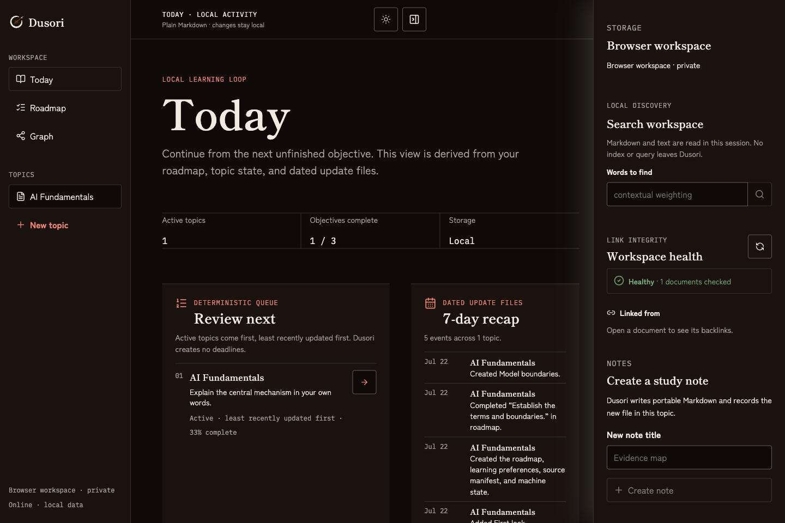
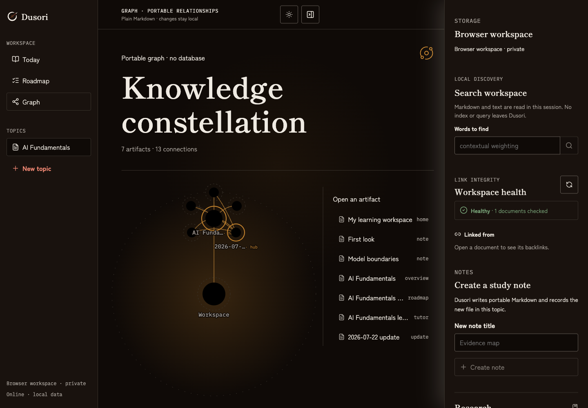
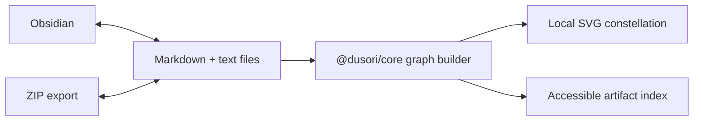

<p align="center">
  
</p>

<p align="center">
  <em>“A second brain should remember who owns the first.”</em>
</p>

<p align="center">
  Free, local-first learning from Markdown and JSON.<br />
  No account · no telemetry · no hosted database · useful without AI
</p>

<p align="center">
  <a href="https://github.com/udhawan97/Dusori/actions/workflows/ci.yml"></a>
  <a href="https://github.com/udhawan97/Dusori/releases/tag/v0.1.0"></a>
  <a href="LICENSE"></a>
  
  
</p>

<p align="center">
  <a href="https://udhawan97.github.io/Dusori/app/"><strong>Open the app</strong></a>
  ·
  <a href="https://udhawan97.github.io/Dusori/docs/">Documentation</a>
  ·
  <a href="https://udhawan97.github.io/Dusori/">Product page</a>
  ·
  <a href="https://github.com/udhawan97/Dusori/releases/tag/v0.1.0">v0.1.0 release</a>
</p>

---

Dusori turns plain Markdown and JSON into a private learning workbench: notes, a checkable roadmap, local sources, dated updates, and a knowledge graph that understands Obsidian-style `[[wikilinks]]`. Start in browser storage or connect one folder. Export a ZIP at any time. The app works offline after its first load and does not need an account, plugin, remote backend, or AI model.

The identity combines Japanese restraint—an open ensō and blade—with rangoli-like Indian geometry at the center. Vermilion marks action; marigold marks connected knowledge. The app starts in black mode and keeps an explicit light/dark choice locally.

## v0.1.0 — the portable foundation

Dusori v0.1.0 is the first public release. It establishes the complete browser-first learning loop: create or connect a workspace, bring in local sources or a curriculum, work through a Markdown roadmap, review Today, follow connections in the graph, and carry the same files into Obsidian or a ZIP backup.

[Read the release notes](https://github.com/udhawan97/Dusori/releases/tag/v0.1.0) · [Review the changelog](CHANGELOG.md)

## The product today



| Surface            | What ships                                                                            |
| ------------------ | ------------------------------------------------------------------------------------- |
| **Today**          | Next unchecked objective, progress, topic state, and recent local updates             |
| **Roadmap**        | Ordinary Markdown checkboxes with active, paused, and complete topic states           |
| **Graph**          | Deterministic constellation of portable artifacts, topic containment, and wikilinks   |
| **Notes**          | Sanitized Markdown, Mermaid diagrams, and explicit conflict proposals                 |
| **Sources**        | Local paste, file, and URL-reference capture with hashes and provenance               |
| **Curricula**      | Preview-first import for structured Markdown and English Microsoft Learn study guides |
| **Portability**    | Browser storage, direct folder access where supported, and ZIP import/export          |
| **Installability** | PWA manifest, service worker, offline reload, and supplied Dusori app icons           |

Remote fetching, search, Ollama transforms, generated schedules, and unattended work are roadmap items. Dusori does not claim they exist yet.

## Obsidian, without surrendering the vault

Dusori uses Obsidian’s most durable interface: folders, Markdown, frontmatter, and wikilinks. No plugin is required.

1. Open or create an Obsidian vault.
2. Create `<Vault>/Dusori/`.
3. In Chrome or Edge on desktop, choose **Use Dusori with Obsidian**.
4. Select only the `Dusori` subfolder—never the whole vault.

Firefox and Safari use the private browser workspace plus ZIP import/export. Folder access is an enhancement, not a portability requirement.

## A graph that remains files

The graph does not introduce a graph database. `@dusori/core` scans readable workspace files, gives every node its normalized relative path, derives containment from topic folders, and resolves `[[wikilinks]]`. Unresolved links remain visible instead of being guessed. Coordinates are never written into the workspace.





## Portable file contract

```text
<Dusori Root>/
├── Home.md
├── dusori.json
└── Topics/<topic-slug>/
    ├── Overview.md
    ├── roadmap.md
    ├── TUTOR.md
    ├── state.json
    ├── Notes/
    ├── Updates/YYYY/MM/YYYY-MM-DD.md
    ├── Sources/
    │   ├── manifest.json
    │   └── items/<hash>-<source-name>.md|txt
    └── Backups/
```

Markdown and text are user-owned. JSON is machine-owned, schema-versioned, and validated. If a Markdown file changed outside Dusori, that file stays active and Dusori writes a dated `.proposed-…` version beside it. Acceptance is always explicit and recorded in `Updates/`.

## Architecture

```text
apps/app                  SvelteKit browser/PWA workbench
apps/site                 Astro + Starlight product and documentation site
packages/core             Storage-neutral domain, learning loop, graph, conflicts
packages/storage-opfs     Private browser workspace adapter
packages/storage-fsa      User-approved folder adapter
packages/companion        Optional token-protected loopback foundation
tests/e2e                 Built Pages artifact and user-flow verification
```

The browser app calls storage-neutral core modules. Storage adapters provide the same interface to OPFS, the File System Access API, memory tests, and the optional local companion. There is no hosted application backend.

## Browser support

| Capability                | Chrome / Edge desktop | Firefox / Safari  | Mobile                      |
| ------------------------- | --------------------- | ----------------- | --------------------------- |
| Private browser workspace | Yes                   | Yes               | Yes¹                        |
| ZIP import/export         | Yes                   | Yes               | Yes                         |
| Direct folder connection  | Yes                   | No; use ZIP       | Chrome Android best-effort² |
| Offline after first load  | Yes                   | Yes¹              | Yes¹                        |
| Install                   | PWA                   | Add to Dock / tab | PWA / Home Screen           |

¹ Browser storage retention varies. Install where supported and keep exported backups.<br />
² Mobile folder writes are not atomic; ZIP remains the portability baseline.

## Develop and verify

Prerequisites: Node.js 24 LTS and pnpm 11.

```sh
corepack enable
pnpm install
pnpm check
pnpm test:e2e
```

Useful commands:

```sh
pnpm dev:app       # SvelteKit app
pnpm dev:site      # Astro/Starlight site
pnpm test:unit     # core, storage, and companion tests
pnpm build         # compose the exact GitHub Pages artifact
pnpm preview       # serve dist/pages locally
```

The optional companion can be built from this repository:

```sh
pnpm build
pnpm --filter dusori dev -- --root /path/to/Dusori
```

The v0.1.0 release is the hosted browser app and its source. `npx dusori` remains the intended public companion command, but the companion is not published to npm yet. Build it from this repository using the command above.

See [CHANGELOG.md](CHANGELOG.md), [CONTRIBUTING.md](CONTRIBUTING.md), [SECURITY.md](SECURITY.md), the [architecture decisions](docs/adr/), and the [product specification](docs/product/spec.md).

## License

Dusori is released under the [Apache License 2.0](LICENSE). Bundled fonts retain their SIL Open Font License files under `apps/app/static/fonts/licenses/`.
