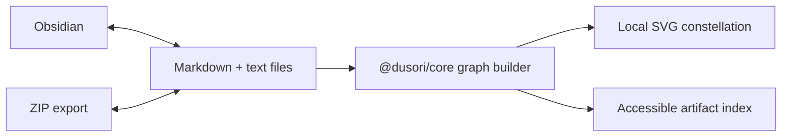

<p align="center">
  
</p>

<p align="center">
  <em>“A second brain should remember who owns the first.”</em>
</p>

<p align="center">
  Free, local-first learning from Markdown and JSON.<br />
  No account · no telemetry · no hosted database · useful without AI
</p>

<p align="center">
  <a href="https://github.com/udhawan97/Dusori/actions/workflows/ci.yml"></a>
  <a href="https://github.com/udhawan97/Dusori/releases/tag/v0.4.0"></a>
  <a href="LICENSE"></a>
  
  
</p>

<p align="center">
  <a href="https://udhawan97.github.io/Dusori/app/"><strong>Open the app</strong></a>
  ·
  <a href="https://udhawan97.github.io/Dusori/docs/">Documentation</a>
  ·
  <a href="https://udhawan97.github.io/Dusori/">Product page</a>
  ·
  <a href="https://github.com/udhawan97/Dusori/releases/tag/v0.4.0">v0.4.0 release</a>
</p>

---

Dusori turns plain Markdown and JSON into a private learning workbench: notes, a checkable roadmap, local sources, dated updates, and a knowledge graph that understands Obsidian-style `[[wikilinks]]`. Start in browser storage or connect one folder. Export a ZIP at any time. The app works offline after its first load and does not need an account, plugin, remote backend, or AI model.

The identity combines Japanese restraint—an open ensō and blade—with rangoli-like Indian geometry at the center. Vermilion marks action; marigold marks connected knowledge. The app starts in black mode and keeps an explicit light/dark choice locally.

## v0.4.0 — the local workbench

Dusori v0.4.0 adds conflict-safe Markdown note authoring, local full-text search, backlinks, explicit workspace health, a deterministic review queue, and a seven-day recap. ZIP replacement now validates the complete archive before confirmation and restores the previous snapshot if a write fails. The optional companion is packaged for `npx` with version alignment and packed-tarball smoke checks.

[Read the release notes](https://github.com/udhawan97/Dusori/releases/tag/v0.4.0) · [Review the changelog](CHANGELOG.md)

## The product today


| Surface            | What ships                                                                                                                    |
| ------------------ | ----------------------------------------------------------------------------------------------------------------------------- |
| **Today**          | Deterministic review order with optional spaced-review due dates, seven-day recap, progress, topic state, and next objectives |
| **Roadmap**        | Ordinary Markdown checkboxes with active, paused, and complete topic states                                                   |
| **Graph**          | Deterministic constellation of portable artifacts, topic containment, and wikilinks                                           |
| **Notes**          | Create, edit, and render portable Markdown with explicit proposals when another editor wrote first                            |
| **Search**         | Case- and accent-insensitive local search over Markdown/text with no persisted index or network request                       |
| **Link health**    | Backlinks plus non-mutating checks for unresolved links and source-manifest/file drift                                        |
| **Sources**        | Paste, local file, URL reference, accepted research capture with provenance, and companion-powered full-content upgrades      |
| **Research**       | Consent-gated Microsoft Learn and Wikipedia suggestions from a roadmap objective                                              |
| **Curricula**      | Preview-first import for structured Markdown and English Microsoft Learn study guides                                         |
| **Portability**    | Browser storage, direct folder access, ZIP export, and validated rollback-safe replacement import                             |
| **Installability** | PWA manifest, service worker, offline reload, and supplied Dusori app icons                                                   |

Key-based or general web search, Ollama transforms, and unattended work remain roadmap items. Workspace search is strictly local: it scans readable Markdown and text in the current session and creates no hidden index. With the optional local companion running, Dusori also fetches the readable text of a URL source you explicitly confirm and proxies Microsoft Learn's ranked search; the hosted app alone stays keyless and limited to the Microsoft Learn catalog and English Wikipedia APIs.

## Obsidian, without surrendering the vault

Dusori uses Obsidian’s most durable interface: folders, Markdown, frontmatter, and wikilinks. No plugin is required.

1. Open or create an Obsidian vault.
2. Create `<Vault>/Dusori/`.
3. In Chrome or Edge on desktop, choose **Use Dusori with Obsidian**.
4. Select only the `Dusori` subfolder—never the whole vault.

Firefox and Safari use the private browser workspace plus ZIP import/export. Folder access is an enhancement, not a portability requirement.

## A graph that remains files

The graph does not introduce a graph database. `@dusori/core` scans readable workspace files, gives every node its normalized relative path, derives containment from topic folders, and resolves `[[wikilinks]]`. Backlinks reverse those resolved edges. Workspace health reports unresolved links and source-manifest/file drift without repairing or quarantining files implicitly. Coordinates and health state are never written into the workspace.




## Portable file contract

```text
<Dusori Root>/
├── Home.md
├── dusori.json
└── Topics/<topic-slug>/
    ├── Overview.md
    ├── roadmap.md
    ├── TUTOR.md
    ├── state.json
    ├── research.json               # created after the first dismissal
    ├── review.json                 # created after the first review action
    ├── Notes/
    ├── Updates/YYYY/MM/YYYY-MM-DD.md
    ├── Sources/
    │   ├── manifest.json
    │   └── items/<hash>-<source-name>.md|txt
    └── Backups/
```

Markdown and text are user-owned. JSON is machine-owned, schema-versioned, and validated. If a Markdown file changed outside Dusori, that file stays active and Dusori writes a dated `.proposed-…` version beside it. Acceptance is always explicit and recorded in `Updates/`.

## Architecture

```text
apps/app                  SvelteKit browser/PWA workbench
apps/site                 Astro + Starlight product and documentation site
packages/core             Storage-neutral domain, learning loop, research, graph, conflicts
packages/storage-opfs     Private browser workspace adapter
packages/storage-fsa      User-approved folder adapter
packages/companion        Optional token-protected loopback research service
tests/e2e                 Built Pages artifact and user-flow verification
```

The browser app calls storage-neutral core modules. OPFS, the File System Access API, and memory tests implement the same storage interface; the optional companion is a separate, token-protected loopback transport for bounded research operations. There is no hosted application backend.

## Browser support

| Capability                | Chrome / Edge desktop | Firefox / Safari  | Mobile                      |
| ------------------------- | --------------------- | ----------------- | --------------------------- |
| Private browser workspace | Yes                   | Yes               | Yes¹                        |
| ZIP import/export         | Yes                   | Yes               | Yes                         |
| Direct folder connection  | Yes                   | No; use ZIP       | Chrome Android best-effort² |
| Offline after first load  | Yes                   | Yes¹              | Yes¹                        |
| Install                   | PWA                   | Add to Dock / tab | PWA / Home Screen           |

¹ Browser storage retention varies. Install where supported and keep exported backups.<br />
² Mobile folder writes are not atomic; ZIP remains the portability baseline.

## Develop and verify

Prerequisites: Node.js 24 LTS and pnpm 11.

```sh
corepack enable
pnpm install
pnpm check
pnpm test:e2e
```

Useful commands:

```sh
pnpm dev:app       # SvelteKit app
pnpm dev:site      # Astro/Starlight site
pnpm test:unit     # core, storage, and companion tests
pnpm build         # compose the exact GitHub Pages artifact
pnpm preview       # serve dist/pages locally
```

Run the optional companion from its published npm package:

```sh
npx @udhawan97/dusori@0.4.0 --root /path/to/Dusori
```

Or build it from this repository:

```sh
pnpm build
pnpm --filter @udhawan97/dusori dev -- --root /path/to/Dusori
```

The companion binds only to `127.0.0.1`, issues a new token for each run, removes that token from the browser address after connection, and stops with its terminal process. Folder access remains off unless `--root` names one explicit Dusori directory. `npx @udhawan97/dusori@0.4.0 --help` and `--version` exit without starting the service.

**Compatibility note:** do not reopen a workspace containing a companion-upgraded source with v0.2.0. That older reader can rename `Sources/manifest.json` to an `.invalid-<timestamp>` file after seeing the newer provenance value. Source content remains untouched; update to v0.3.0 or later and rename the manifest back if this has already happened.

See [CHANGELOG.md](CHANGELOG.md), [CONTRIBUTING.md](CONTRIBUTING.md), [SECURITY.md](SECURITY.md), the [architecture decisions](docs/adr/), and the [product specification](docs/product/spec.md).

## License

Dusori is released under the [Apache License 2.0](LICENSE). Bundled fonts retain their SIL Open Font License files under `apps/app/static/fonts/licenses/`.

## Acknowledgements

- [Graphify-Labs/graphify](https://github.com/Graphify-Labs/graphify) (MIT) for the constellation, link-affinity, and “god node” hub ideas.
- [tt-a1i/archify](https://github.com/tt-a1i/archify) (MIT) for the geometry self-audit idea.
- [chanhx/crabviz](https://github.com/chanhx/crabviz) (AGPL-3.0) for the focus-fade idea only; no code was copied or derived.

These ideas were reimplemented independently; no code was copied.
