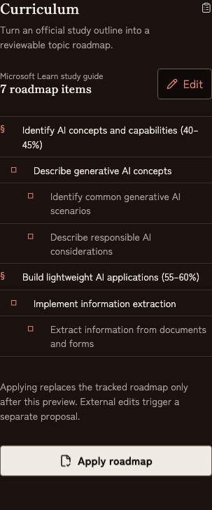

<p align="center">
  
</p>

<h1 align="center">A private learning workbench you can leave.</h1>

<p align="center">
  Dusori turns your Markdown, PDFs, and saved sources into a calm daily learning loop.<br>
  Your useful work stays on your device, in ordinary files—not inside an account.
</p>

<p align="center">
  <a href="https://udhawan97.github.io/Dusori/app/"></a>
  <a href="https://github.com/udhawan97/Dusori/archive/refs/tags/v0.9.1.zip"></a>
  <a href="#run-dusori-on-your-computer"></a>
</p>

<p align="center">
  <a href="https://github.com/udhawan97/Dusori/releases/latest"></a>
  <a href="https://github.com/udhawan97/Dusori/actions/workflows/ci.yml"></a>
  
  
  <a href="LICENSE"></a>
</p>

<p align="center">
  <a href="#choose-your-start">Start</a> ·
  <a href="#what-dusori-helps-you-do">What it does</a> ·
  <a href="#your-files-stay-yours">Your files</a> ·
  <a href="#run-dusori-on-your-computer">Run locally</a> ·
  <a href="https://udhawan97.github.io/Dusori/docs/">Read the docs</a>
</p>

---

## Choose your start

You do not need to understand the technology before using Dusori.

| If you want to…                  | Choose                                                                                  | What happens                                                                                   |
| -------------------------------- | --------------------------------------------------------------------------------------- | ---------------------------------------------------------------------------------------------- |
| Try it now                       | **[Open Dusori](https://udhawan97.github.io/Dusori/app/)**                              | It opens in your browser. No account or terminal.                                              |
| Keep it like an app              | **[Install from your browser](https://udhawan97.github.io/Dusori/app/)**                | Where supported, use **Install**, **Add to Dock**, or **Add to Home Screen** after opening it. |
| Run the current release locally  | **[Use the npm companion](#fastest-local-start)**                                       | With Node.js 24 installed, `npx` downloads and opens Dusori without a global install.          |
| Run the current release yourself | **[Download v0.9.1](https://github.com/udhawan97/Dusori/archive/refs/tags/v0.9.1.zip)** | Unzip it, install Node.js 24 LTS, then run `npm start`.                                        |
| Inspect or contribute            | **[Clone the source](#run-dusori-on-your-computer)**                                    | You get the full monorepo and contributor workflow.                                            |

> [!IMPORTANT]
> The app and [public npm companion](https://www.npmjs.com/package/@udhawan97/dusori/v/0.9.1) are aligned at **v0.9.1**. Dusori requires Node.js 24 LTS when you run it locally.

<p align="center">
  
  <br>
  <sub><em>Today is a quiet routing desk: continue what has evidence, or fix what genuinely needs attention.</em></sub>
</p>

## What Dusori helps you do

Dusori keeps the learning process visible. It does not quietly invent progress, urgency, or mastery.

| Part of Dusori         | In plain English                                                                                                      |
| ---------------------- | --------------------------------------------------------------------------------------------------------------------- |
| **Today**              | Shows the next evidence-backed action and real workspace problems worth fixing.                                       |
| **Curriculum**         | Turns a study guide—or a supported AWS exam-guide PDF—into a roadmap you review before saving.                        |
| **Research**           | Finds candidate sources only from providers you allow, then lets you accept what belongs in your workspace.           |
| **Notes and sources**  | Keeps Markdown, text—including text extracted locally from PDFs—saved pages, provenance, and links together by topic. |
| **Review**             | Builds recall prompts from your own sources. Only your explicit answer changes the review schedule.                   |
| **Graph and Insights** | Shows connections, backlinks, unresolved links, tags, activity, and topic depth derived from your files.              |

### A learning loop with a beginning and an end

1. **Bring a topic.** Start from a study guide, your own outline, or a blank roadmap.
2. **Choose the evidence.** Review sources before accepting them. Network providers are off until you allow them.
3. **Make something durable.** Write a note, connect ideas, or finish a roadmap objective.
4. **Return honestly.** Mark a topic reviewed only when you mean it; Dusori never claims mastery for you.

<p align="center">
  
  <br>
  <sub><em>A pasted Microsoft guide and a supported AWS PDF use the same preview-before-apply path.</em></sub>
</p>

<details>
<summary><strong>See every current capability</strong></summary>

<br>

| You do this                   | Dusori gives you                                                                                                   |
| ----------------------------- | ------------------------------------------------------------------------------------------------------------------ |
| Open Today                    | Continuation and attention lanes backed by workspace evidence, without changing progress.                          |
| Check roadmap objectives      | Portable Markdown progress, explicit topic state, and a seven-day file-derived recap.                              |
| Mark a topic reviewed         | An optional spaced schedule—1, 3, 7, 14, 30, then 60 days—that rests the topic until it is due.                    |
| Start a review                | Active-recall prompts from that topic’s sources, an answer box, and answers saved as a note.                       |
| Create or edit Markdown       | Portable notes and an explicit proposal when another editor changed the same file first.                           |
| Search the workspace          | Case- and accent-insensitive local search plus a `tag:` filter, with no hidden remote index.                       |
| Write `#tags` or `tags:`      | Tags read directly from Markdown and used by search, Graph, and Insights.                                          |
| Explore Graph                 | An adjustable constellation, artifact finder, link ledger, backlinks, and unresolved-link checks.                  |
| Save sources                  | Pasted text, Markdown, text extracted locally from PDFs, URL references, provenance, and preview-first acceptance. |
| Create a topic                | Consent-gated discovery across allowed providers with an explainable top-five shortlist.                           |
| Set learning preferences      | A structured edit to `TUTOR.md`, shown as a diff and written only after acceptance.                                |
| Open Insights                 | Local activity, artifact mix, link health, topic depth, hubs, provenance, tags, and review pressure.               |
| Import a study guide          | A reviewable roadmap from pasted text or a supported AWS exam-guide PDF, preserving the extracted outline.         |
| Run the companion             | Loopback-only page capture, optional search providers, arXiv, Reddit, YouTube, and optional AI.                    |
| Export or replace a workspace | A validated ZIP with confirmation and rollback protection, or one portable topic.                                  |

General web search is optional companion configuration. Brave and Tavily use your keys; SearXNG offers a keyless, open-source route. Ollama, Anthropic, or OpenAI can optionally advise ranking, write a clearly labeled brief from accepted sources, or reword review prompts under separate consent. Deterministic ranking, briefs, and prompts remain the baseline.

Unattended research is not implemented. Dusori creates no calendar, notification, or background work. A review session stores nothing and never claims mastery until you explicitly choose **Got it** or **Needs work**.

</details>

## Your files stay yours

The durable interface is deliberately ordinary: folders, Markdown, text, JSON, and ZIPs. A PDF is read locally; Dusori stores its extracted text, not a copy of the original PDF.

| Promise                 | What it means                                                                                                |
| ----------------------- | ------------------------------------------------------------------------------------------------------------ |
| **No account**          | There is no Dusori identity system or hosted profile.                                                        |
| **Local workspace**     | Notes and progress live in the workspace; search, graph layout, backlinks, and Insights stay on this device. |
| **Portable by default** | Export the whole workspace or one topic; open the Markdown without Dusori.                                   |
| **Conflict-aware**      | If another editor changed a Markdown file, Dusori preserves it and writes a dated proposal beside it.        |
| **Network by consent**  | Discovery, page capture, and AI are optional and disclose what will leave your device.                       |
| **Useful without AI**   | Core learning, search, graph, reviews, briefs, and ranking have deterministic paths.                         |

<details open>
<summary><strong>The portable workspace</strong></summary>

```text
<Dusori Root>/
├── Home.md
├── dusori.json
└── Topics/<topic-slug>/
    ├── Overview.md
    ├── roadmap.md
    ├── TUTOR.md
    ├── state.json
    ├── research.json
    ├── review.json
    ├── proposals.json
    ├── Notes/
    ├── Updates/YYYY/MM/YYYY-MM-DD.md
    ├── Sources/
    │   ├── manifest.json
    │   └── items/<hash>-<source-name>.md|txt
    └── Backups/
```

Markdown and text are user-owned. JSON is machine-owned, schema-versioned, and validated. When a Markdown file changes outside Dusori, the current file stays active and Dusori writes a dated `.proposed-…` version for review. `proposals.json` keeps that choice visible across reloads.

</details>

### Obsidian without surrendering the vault

Dusori uses Obsidian’s durable language—folders, frontmatter, Markdown, and wikilinks. No plugin is required.

1. Open or create an Obsidian vault.
2. Create `<Vault>/Dusori/`.
3. In desktop Chrome or Edge, choose **Use Dusori with Obsidian**.
4. Approve only the `Dusori` subfolder, never the whole vault.

Firefox and Safari use a private browser workspace with ZIP import and export. Folder access is an enhancement; portable files remain the baseline.

### The graph remains files

`@dusori/core` reads workspace files, derives topic containment, and resolves `[[wikilinks]]`. Backlinks reverse those edges. Dusori never writes graph coordinates or health state into your workspace, and there is no graph database.

```mermaid
flowchart LR
  files["Markdown + text files"] --> core["@dusori/core graph builder"]
  core --> graph["Local SVG constellation"]
  core --> index["Accessible artifact index"]
  obsidian["Obsidian"] <--> files
  zip["ZIP export"] <--> files
```

<p align="center">
  
</p>

## Run Dusori on your computer

You need [Node.js 24 LTS](https://nodejs.org/en/download). Dusori runs on macOS, Windows, and Linux.

### Fastest local start

```bash
npx @udhawan97/dusori@latest
```

This downloads the current companion and opens Dusori without a global install. To approve one existing workspace folder for that session:

```bash
npx @udhawan97/dusori@latest --root "/path/to/Dusori"
```

### From the release ZIP

1. **[Download Dusori v0.9.1](https://github.com/udhawan97/Dusori/archive/refs/tags/v0.9.1.zip)** and unzip it.
2. Open a terminal in the unzipped `Dusori-0.9.1` folder.
3. Run:

```bash
npm start
```

The first start downloads the repository-pinned pnpm version, installs dependencies, builds Dusori, and opens it on a random `127.0.0.1` port. Closing the terminal stops the local companion; nothing remains as a background daemon.

### From Git

```bash
git clone https://github.com/udhawan97/Dusori.git
cd Dusori
npm start
```

To approve one existing workspace folder for that local session:

```bash
npm start -- --root "/path/to/Dusori"
```

Use `npm run setup` to install and build without launching. Run it once after pulling new source to refresh the local build.

## Browser support

| Capability                | Chrome / Edge desktop | Firefox / Safari   | Mobile                      |
| ------------------------- | --------------------- | ------------------ | --------------------------- |
| Private browser workspace | Yes                   | Yes                | Yes¹                        |
| ZIP import and export     | Yes                   | Yes                | Yes                         |
| Direct folder connection  | Yes                   | Use ZIP            | Chrome Android best-effort² |
| Offline after first load  | Yes                   | Yes¹               | Yes¹                        |
| Install like an app       | PWA                   | Add to Dock or tab | PWA or Home Screen          |

¹ Browser storage retention varies. Install where supported and keep exported backups.<br>
² Mobile folder writes are not atomic; ZIP remains the portability baseline.

## Network and privacy boundaries

<details>
<summary><strong>What can leave the device?</strong></summary>

- Microsoft Learn, English Wikipedia, Hacker News, GitHub, Stack Exchange, OpenAlex, and npm discovery call their public APIs only after per-provider consent.
- The optional companion can add arXiv, Reddit, YouTube through your Invidious instance, and one Brave, Tavily, or SearXNG provider. Credentials stay in the companion process.
- PDFs are read on your device by a reader bundled with the app and loaded on first use. The original document is never uploaded or copied into the workspace; its extracted text is stored instead. A scan without a text layer is reported rather than stored empty.
- Page capture begins only after you confirm the exact host. The companion rejects non-public destinations and rechecks redirects.
- Optional AI receives only the disclosed query plus candidate or accepted-source metadata. A failed AI step keeps the deterministic result.
- The companion binds only to `127.0.0.1`, creates a fresh session token, and removes that token from the browser address after connecting.

</details>

## For developers

Dusori is a TypeScript monorepo with a storage-neutral core and separate browser, site, storage, and loopback boundaries.

```text
apps/app                  SvelteKit browser/PWA workbench
apps/site                 Astro + Starlight product and documentation site
packages/core             Learning, research, review, graph, and conflict domain
packages/storage-opfs     Private browser workspace adapter
packages/storage-fsa      User-approved folder adapter
packages/companion        Optional token-protected loopback service
scripts/local.mjs         Cross-platform setup and local launcher
tests/e2e                 Built Pages artifact and user-flow verification
```

```bash
# Node.js 24 LTS + pnpm 11
pnpm install
pnpm dev:app

# Full quality gate
pnpm check

# Built-site browser tests
pnpm test:e2e
```

`npm run setup` uses the exact pnpm version pinned in `package.json`; Corepack and a global pnpm install are not required.

<details>
<summary><strong>Package smoke check</strong></summary>

```bash
pnpm build
pnpm smoke:companion
```

The smoke check packs a real tarball, runs its CLI through npm, and verifies that the app shell and service worker are included. It checks the repository package; it does not prove the public npm registry is current.

</details>

## Troubleshooting

| Symptom                          | What to do                                                                                |
| -------------------------------- | ----------------------------------------------------------------------------------------- |
| `Dusori requires Node.js 24 LTS` | Install [Node.js 24 LTS](https://nodejs.org/en/download), open a new terminal, and retry. |
| The browser did not open         | Open the `http://127.0.0.1:…` address printed in the terminal.                            |
| Folder access is unavailable     | Use desktop Chrome or Edge, or use browser storage with ZIP import and export.            |
| A PDF outline is not recognized  | Dusori leaves the extracted text editable; trim it and preview before saving.             |
| Your workspace matters           | Export a ZIP after meaningful work and keep it with your normal backups.                  |

More help: [Getting started](https://udhawan97.github.io/Dusori/docs/getting-started/) · [Browser support](https://udhawan97.github.io/Dusori/docs/browser-support/) · [Security policy](SECURITY.md)

## Current release

**v0.9.1** is the current patch release. It carries the on-device exam-guide PDF workflow from v0.9.0 and adds a release-integrity guard so npm provenance must match the exact tagged source.

[Read the v0.9.1 notes](https://github.com/udhawan97/Dusori/releases/tag/v0.9.1) · [Review the changelog](CHANGELOG.md)

## Contributing and license

Issues and pull requests are welcome. Preserve the portable file contract, offline baseline, conflict safety, explicit network consent, and honest capability reporting. Read [CONTRIBUTING.md](CONTRIBUTING.md) before changing a storage or network boundary.

Released under the [Apache License 2.0](LICENSE). Bundled fonts retain their SIL Open Font License files under `apps/app/static/fonts/licenses/`.

<p align="center">
  <strong>Your files stay useful with or without Dusori.</strong><br>
  <sub>That is the point.</sub>
</p>
