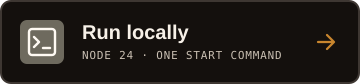
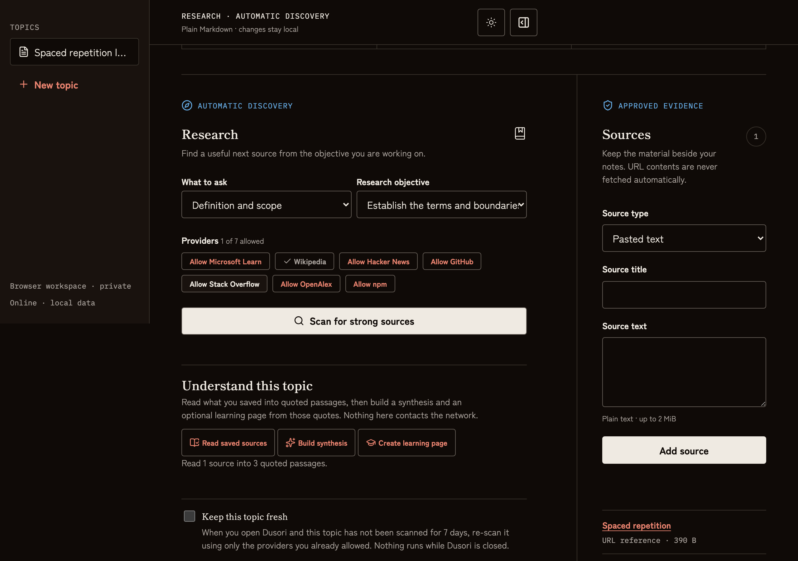
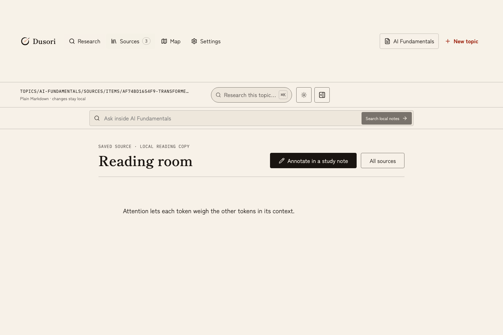
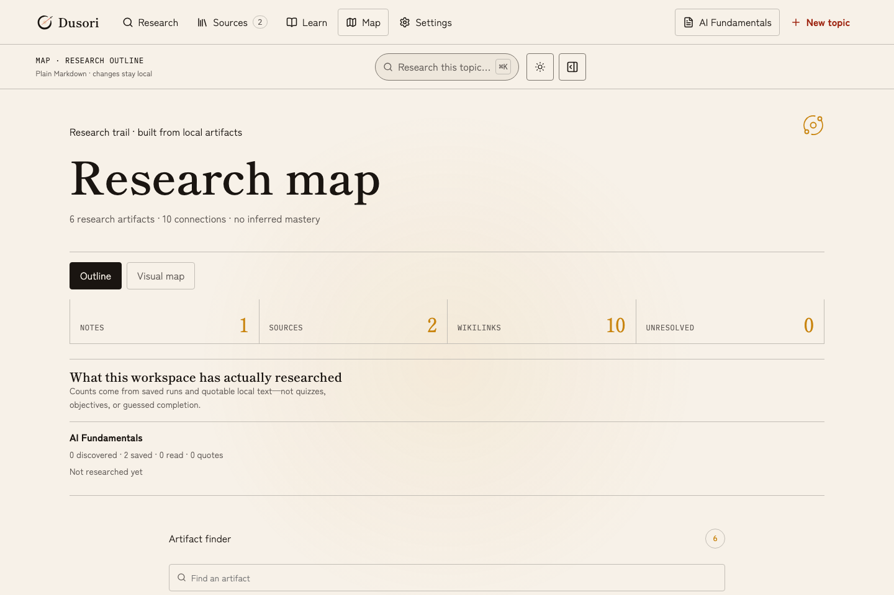

<p align="center">
  <a href="https://udhawan97.github.io/Dusori/app/"></a>
</p>

<p align="center">
  
</p>

<h1 align="center">Ask a hard question. Get an honest research brief.</h1>

<p align="center">
  Dusori searches sources you permit, keeps a durable evidence trail, reads what it legitimately can,<br>
  and shows what the sources support. No account. No telemetry. Ordinary local files.
</p>

<p align="center">
  <a href="https://udhawan97.github.io/Dusori/app/"></a>
  &nbsp;
  <a href="https://github.com/udhawan97/Dusori/releases/tag/v0.12.3"></a>
  &nbsp;
  <a href="https://udhawan97.github.io/Dusori/docs/getting-started/"></a>
</p>

<p align="center">
  <a href="https://udhawan97.github.io/Dusori/docs/"><strong>Read the guide</strong></a> ·
  <a href="https://udhawan97.github.io/Dusori/docs/releases/v0-12-3/"><strong>Release notes</strong></a> ·
  <a href="https://github.com/udhawan97/Dusori/releases/download/v0.12.3/SHA256SUMS.txt"><strong>Verify checksums</strong></a>
</p>

<p align="center">
  <a href="https://github.com/udhawan97/Dusori/releases/latest"></a>
  <a href="https://github.com/udhawan97/Dusori/actions/workflows/ci.yml"></a>
  
  <a href="LICENSE"></a>
</p>

---

## The research loop

Dusori is organized around the question—not around objectives or setup machinery.

1. **Ask.** Enter the topic or question in plain language.
2. **Research.** Dusori searches permitted providers, removes duplicate URLs, ranks a varied shortlist, and saves up to eight sources.
3. **Read.** Provider extracts and guarded companion fetches become local reading copies; blocked pages stay browser-ready references.
4. **Synthesize.** Quotable passages become one honest brief with visible gaps and citations.
5. **See the trail.** Map opens as a searchable Outline; the visual evidence atlas separates every topic into source, note, brief, and update lanes.

<p align="center">
  
  <br><sub><em>One question starts the search, source capture, reading, and synthesis flow.</em></sub>
</p>

## Four places, each with one job

| Place        | What it is for                                                                                     |
| ------------ | -------------------------------------------------------------------------------------------------- |
| **Research** | Ask once; search, rank, save, read, and build a source-backed brief.                               |
| **Sources**  | Read local evidence, open blocked pages in the browser, add your own material, remove, or restore. |
| **Map**      | Follow actual discovered, saved, read, and quoted work in an Outline or separated evidence atlas.  |
| **Settings** | Appearance, storage, privacy, provider decisions, import/export, and updates.                      |

The Research Desk adds the ranked shortlist to Sources automatically. Readable provider captures can support claims immediately; URL-only results stay labeled references. A 401, 403, or 429 remains visible and always keeps **Open original** as a browser fallback.

Objectives, review, roadmaps, and certification outline import remain available as optional learning tools under **Settings**. They never gate the question-to-brief workflow.

<p align="center">
  
  <br><sub><em>A saved source opens as a local reading copy. The evidence shelf remains one action away.</em></sub>
</p>

## Choose how to run it

| Choice                    | Best for                                                             | Start                                                                                                                                               |
| ------------------------- | -------------------------------------------------------------------- | --------------------------------------------------------------------------------------------------------------------------------------------------- |
| **Browser**               | Trying Dusori now; installable PWA and offline shell where supported | **[Open Dusori](https://udhawan97.github.io/Dusori/app/)**                                                                                          |
| **macOS — Apple silicon** | M-series Macs; bundled app and signed in-app updater feed            | **[Download Apple silicon `.dmg`](https://github.com/udhawan97/Dusori/releases/download/v0.12.3/Dusori_0.12.3_aarch64-aarch64-apple-darwin.dmg)**   |
| **Windows — x64**         | 64-bit Windows; bundled app and signed in-app updater feed           | **[Download Windows x64 `.exe`](https://github.com/udhawan97/Dusori/releases/download/v0.12.3/Dusori_0.12.3_x64-setup-x86_64-pc-windows-msvc.exe)** |
| **Node companion**        | Browser UI plus local page capture and extra providers               | `npx @udhawan97/dusori@latest`                                                                                                                      |
| **Source**                | Audit, modify, or build Dusori yourself                              | **[Source ZIP](https://github.com/udhawan97/Dusori/archive/refs/tags/v0.12.3.zip)**                                                                 |

The v0.12.3 macOS and Windows installers are open-source release builds, but they are **not Apple-notarized or Microsoft code-signed**. Gatekeeper or SmartScreen may warn on first launch. Verify the asset against `SHA256SUMS.txt` on the release page. The separate in-app update artifacts are cryptographically signed by Dusori’s updater key.

Already installed a v0.12.0 or v0.12.1 desktop build? Install v0.12.3 manually once. Both affected versions open to a launch-time 404, so Settings is inaccessible. The Intel v0.12.0 Mac build also cannot safely choose the Apple silicon updater feed. Your workspace is separate from the app bundle and remains in place. Normal in-app updates work from v0.12.2 onward.

### Local companion

Install [Node.js 24 LTS](https://nodejs.org/en/download), then run:

```bash
npx @udhawan97/dusori@latest
```

To approve one existing workspace folder for that session:

```bash
npx @udhawan97/dusori@latest --root "/path/to/Dusori"
```

The companion binds to loopback, uses a fresh per-run credential, and stops with its terminal. The credential is not placed in the opened URL, stdout, or logs.

## Updates are explicit

The browser build updates when the hosted site refreshes. In the desktop app, **Settings → App updates** can:

- check GitHub’s latest release feed on demand;
- optionally check and download automatically at application startup;
- display the offered version and release notes;
- verify the updater signature before the download becomes ready;
- install and relaunch only after you choose **Install and restart**.

Dusori never installs or restarts itself. It blocks installation while the current work has unsaved changes. If an update fails, the installed version remains the recovery path; use the matching installer and checksum from the release page. See the [update and recovery guide](https://udhawan97.github.io/Dusori/docs/updates/).

## Research without a hidden researcher

Every provider begins off. The first request asks permission and says what leaves the device. A durable trail distinguishes results, empty responses, and failures.

| Runs where         | Providers                                                                                              | Account or key                                                                                   |
| ------------------ | ------------------------------------------------------------------------------------------------------ | ------------------------------------------------------------------------------------------------ |
| Browser or desktop | Microsoft Learn, Wikipedia, Hacker News, GitHub, Stack Overflow, OpenAlex, Crossref, Open Library, npm | None for discovery                                                                               |
| Local companion    | arXiv                                                                                                  | None                                                                                             |
| Local companion    | General web through SearXNG                                                                            | Self-hosted or public instance you choose                                                        |
| Local companion    | Brave Search or Tavily                                                                                 | Your API key; free tier may be available                                                         |
| Local companion    | Reddit                                                                                                 | Your own Reddit app credentials                                                                  |
| Local companion    | YouTube Data API v3 (preferred) or Invidious fallback                                                  | Your `YOUTUBE_API_KEY`, or an optional self-hosted `INVIDIOUS_URL`; metadata and references only |
| Local companion    | Ollama                                                                                                 | Running loopback chat model must pass a structured generation check; no hosted account required  |
| Local companion    | Anthropic or OpenAI                                                                                    | Your key and provider terms                                                                      |

Dusori does not scrape social sites behind a login, bypass access controls, download YouTube media, or promise that a third-party free tier will remain available. Provider availability and usage terms belong to each provider. See the [provider and legal matrix](https://udhawan97.github.io/Dusori/docs/research-providers/).

The [open research stack evaluation](docs/research/2026-08-05-open-research-stack-evaluation.md) credits the projects studied for orchestration, metasearch, extraction, and local-model patterns and records why they are inspiration, an optional service, or a future dependency—not hidden runtime code.

AI is optional. Deterministic ranking, source storage, quoted synthesis structure, and graph construction work without it. Any AI feature has its own disclosure and labels its model output.

## The files remain the product

```text
<Dusori Root>/
├── Home.md
├── dusori.json
└── Topics/<topic-slug>/
    ├── Overview.md
    ├── roadmap.md
    ├── Synthesis.md
    ├── TUTOR.md
    ├── state.json
    ├── research.json
    ├── review.json
    ├── proposals.json
    ├── Learning/learn.html
    ├── Notes/
    ├── Updates/YYYY/MM/YYYY-MM-DD.md
    └── Sources/
        ├── manifest.json
        └── items/<hash>-<source-name>.md|txt
```

Markdown and text are user-owned. JSON is machine-owned, schema-versioned, and validated. If another editor changes Markdown before Dusori writes, Dusori keeps that version active and creates a reviewable proposal instead of overwriting it. Unknown compatible data from newer workspaces is preserved during supported edits.

<p align="center">
  
  <br><sub><em>Outline opens first; the optional atlas gives every topic and artifact type its own readable lane.</em></sub>
</p>

## Build from source

```bash
git clone https://github.com/udhawan97/Dusori.git
cd Dusori
npm run setup
npm start
```

Use the repository-pinned pnpm version and Node.js 24 LTS. The main verification gate is:

```bash
pnpm check
```

Architecture decisions live in [`docs/adr`](docs/adr/README.md). Security boundaries and reporting are in [`SECURITY.md`](SECURITY.md). Contributions are welcome under the [Apache 2.0 license](LICENSE).

## Trust boundaries at a glance

- No Dusori account, analytics, telemetry, hosted profile, or hosted workspace database.
- Local search, graph, progress, and insights are derived from workspace files.
- Network providers are consented separately; failure is shown as failure.
- A reference is not evidence, and removed sources stop contributing to Map, counts, and synthesis until restored.
- No background research, notification, installation, or restart while Dusori is closed.
- Export the workspace ZIP regularly, especially when using browser-private storage.

Dusori is open source and built entirely on free/open-source dependencies. Optional hosted providers may impose their own quotas, credentials, or terms.
