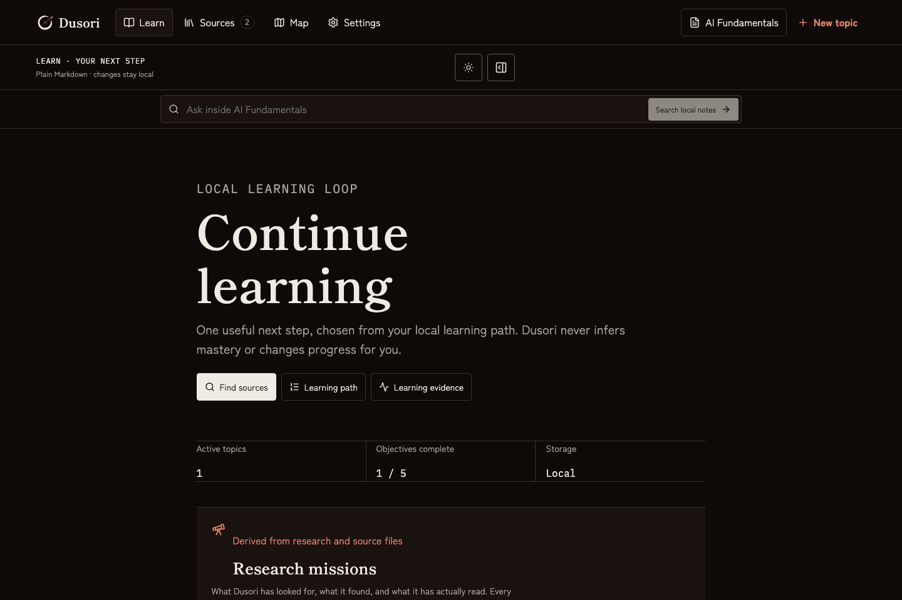

<p align="center">
  
</p>

<h1 align="center">One calm place to learn a hard topic.</h1>

<p align="center">
  Dusori finds sources you permit, keeps what you deliberately save, gives you a focused next step,<br>
  and turns your notes into a map you can inspect. No account. No telemetry. Ordinary local files.
</p>

<p align="center">
  <a href="https://udhawan97.github.io/Dusori/app/"></a>
  &nbsp;
  <a href="https://github.com/udhawan97/Dusori/releases/tag/v0.12.1"></a>
</p>

<p align="center">
  <a href="https://udhawan97.github.io/Dusori/docs/"><strong>Read the guide</strong></a> ·
  <a href="https://udhawan97.github.io/Dusori/docs/releases/v0-12-1/"><strong>Release notes</strong></a> ·
  <a href="https://github.com/udhawan97/Dusori/releases/download/v0.12.1/SHA256SUMS.txt"><strong>Verify checksums</strong></a>
</p>

<p align="center">
  <a href="https://github.com/udhawan97/Dusori/releases/latest"></a>
  <a href="https://github.com/udhawan97/Dusori/actions/workflows/ci.yml"></a>
  
  <a href="LICENSE"></a>
</p>

---

## The daily loop

Dusori is organized around what a learner does next—not around internal tools.

1. **Continue.** Open a certification or general topic and take one evidence-backed next step.
2. **Read.** Open a deliberately saved source in the Reading room. Previewing a search result never saves it.
3. **Annotate.** Keep notes in Markdown, next to the source and its provenance.
4. **Mark learned or review.** Only your explicit action changes roadmap progress or the review schedule.
5. **See the map.** Switch between an explorable galaxy and a linear Outline of the same files.

<p align="center">
  
  <br><sub><em>Learn starts with the next useful action. Sources, Map, and Settings stay predictable.</em></sub>
</p>

## Four places, each with one job

| Place        | What it is for                                                                                                        |
| ------------ | --------------------------------------------------------------------------------------------------------------------- |
| **Learn**    | Continue a roadmap objective, begin a due review, find evidence, or inspect a real workspace issue.                   |
| **Sources**  | See the saved evidence shelf, read a local copy, and deliberately add more. The count comes from the source manifest. |
| **Map**      | Explore notes, sources, tags, backlinks, and unresolved links as a galaxy or accessible Outline.                      |
| **Settings** | Storage, privacy, import/export, companion status, and desktop updates.                                               |

Research is a tool inside a topic, not another place to get lost. A result has a **Preview** action; it reaches Sources only after **Save source** or **Save & read**.

<p align="center">
  
  <br><sub><em>A saved source opens as a local reading copy. The evidence shelf remains one action away.</em></sub>
</p>

## Choose how to run it

| Choice                    | Best for                                                             | Start                                                                                                                                               |
| ------------------------- | -------------------------------------------------------------------- | --------------------------------------------------------------------------------------------------------------------------------------------------- |
| **Browser**               | Trying Dusori now; installable PWA and offline shell where supported | **[Open Dusori](https://udhawan97.github.io/Dusori/app/)**                                                                                          |
| **macOS — Apple silicon** | M-series Macs; bundled app and signed in-app updater feed            | **[Download Apple silicon `.dmg`](https://github.com/udhawan97/Dusori/releases/download/v0.12.1/Dusori_0.12.1_aarch64-aarch64-apple-darwin.dmg)**   |
| **Windows — x64**         | 64-bit Windows; bundled app and signed in-app updater feed           | **[Download Windows x64 `.exe`](https://github.com/udhawan97/Dusori/releases/download/v0.12.1/Dusori_0.12.1_x64-setup-x86_64-pc-windows-msvc.exe)** |
| **Node companion**        | Browser UI plus local page capture and extra providers               | `npx @udhawan97/dusori@latest`                                                                                                                      |
| **Source**                | Audit, modify, or build Dusori yourself                              | **[Source ZIP](https://github.com/udhawan97/Dusori/archive/refs/tags/v0.12.1.zip)**                                                                 |

The v0.12.1 macOS and Windows installers are open-source release builds, but they are **not Apple-notarized or Microsoft code-signed**. Gatekeeper or SmartScreen may warn on first launch. Verify the asset against `SHA256SUMS.txt` on the release page. The separate in-app update artifacts are cryptographically signed by Dusori’s updater key.

Already installed the v0.12.0 Mac build? Install v0.12.1 manually once. That older binary identifies itself as Intel even under Rosetta, so it cannot safely choose the Apple silicon updater feed. Your workspace is separate from the app bundle and remains in place; native in-app updates resume from v0.12.1 onward.

### Local companion

Install [Node.js 24 LTS](https://nodejs.org/en/download), then run:

```bash
npx @udhawan97/dusori@latest
```

To approve one existing workspace folder for that session:

```bash
npx @udhawan97/dusori@latest --root "/path/to/Dusori"
```

The companion binds to loopback, uses a fresh per-run credential, and stops with its terminal. The credential is not placed in the opened URL, stdout, or logs.

## Updates are explicit

The browser build updates when the hosted site refreshes. In the desktop app, **Settings → App updates** can:

- check GitHub’s latest release feed on demand;
- optionally check and download automatically at application startup;
- display the offered version and release notes;
- verify the updater signature before the download becomes ready;
- install and relaunch only after you choose **Install and restart**.

Dusori never installs or restarts itself. It blocks installation while the current work has unsaved changes. If an update fails, the installed version remains the recovery path; use the matching installer and checksum from the release page. See the [update and recovery guide](https://udhawan97.github.io/Dusori/docs/updates/).

## Research without a hidden researcher

Every provider begins off. The first request asks permission and says what leaves the device. A durable trail distinguishes results, empty responses, and failures.

| Runs where         | Providers                                                                      | Account or key                                                                                   |
| ------------------ | ------------------------------------------------------------------------------ | ------------------------------------------------------------------------------------------------ |
| Browser or desktop | Microsoft Learn, Wikipedia, Hacker News, GitHub, Stack Overflow, OpenAlex, npm | None for discovery                                                                               |
| Local companion    | arXiv                                                                          | None                                                                                             |
| Local companion    | General web through SearXNG                                                    | Self-hosted or public instance you choose                                                        |
| Local companion    | Brave Search or Tavily                                                         | Your API key; free tier may be available                                                         |
| Local companion    | Reddit                                                                         | Your own Reddit app credentials                                                                  |
| Local companion    | YouTube Data API v3 (preferred) or Invidious fallback                          | Your `YOUTUBE_API_KEY`, or an optional self-hosted `INVIDIOUS_URL`; metadata and references only |
| Local companion    | Ollama                                                                         | Local model; no hosted account required                                                          |
| Local companion    | Anthropic or OpenAI                                                            | Your key and provider terms                                                                      |

Dusori does not scrape social sites behind a login, bypass access controls, download YouTube media, or promise that a third-party free tier will remain available. Provider availability and usage terms belong to each provider. See the [provider and legal matrix](https://udhawan97.github.io/Dusori/docs/research-providers/).

AI is optional. Deterministic ranking, source storage, synthesis structure, roadmaps, graph construction, and review scheduling remain available without it. Any AI feature has its own disclosure and labels its model output.

## The files remain the product

```text
<Dusori Root>/
├── Home.md
├── dusori.json
└── Topics/<topic-slug>/
    ├── Overview.md
    ├── roadmap.md
    ├── Synthesis.md
    ├── TUTOR.md
    ├── state.json
    ├── research.json
    ├── review.json
    ├── proposals.json
    ├── Learning/learn.html
    ├── Notes/
    ├── Updates/YYYY/MM/YYYY-MM-DD.md
    └── Sources/
        ├── manifest.json
        └── items/<hash>-<source-name>.md|txt
```

Markdown and text are user-owned. JSON is machine-owned, schema-versioned, and validated. If another editor changes Markdown before Dusori writes, Dusori keeps that version active and creates a reviewable proposal instead of overwriting it. Unknown compatible data from newer workspaces is preserved during supported edits.

<p align="center">
  
  <br><sub><em>The galaxy and Outline are two views of the same portable notes, sources, and wikilinks.</em></sub>
</p>

## Build from source

```bash
git clone https://github.com/udhawan97/Dusori.git
cd Dusori
npm run setup
npm start
```

Use the repository-pinned pnpm version and Node.js 24 LTS. The main verification gate is:

```bash
pnpm check
```

Architecture decisions live in [`docs/adr`](docs/adr/README.md). Security boundaries and reporting are in [`SECURITY.md`](SECURITY.md). Contributions are welcome under the [Apache 2.0 license](LICENSE).

## Trust boundaries at a glance

- No Dusori account, analytics, telemetry, hosted profile, or hosted workspace database.
- Local search, graph, progress, and insights are derived from workspace files.
- Network providers are consented separately; failure is shown as failure.
- A preview is not a saved source, a saved source is not a learned objective, and opening a review does not schedule anything.
- No background learning, notification, scan, installation, or restart while Dusori is closed.
- Export the workspace ZIP regularly, especially when using browser-private storage.

Dusori is open source and built entirely on free/open-source dependencies. Optional hosted providers may impose their own quotas, credentials, or terms.
